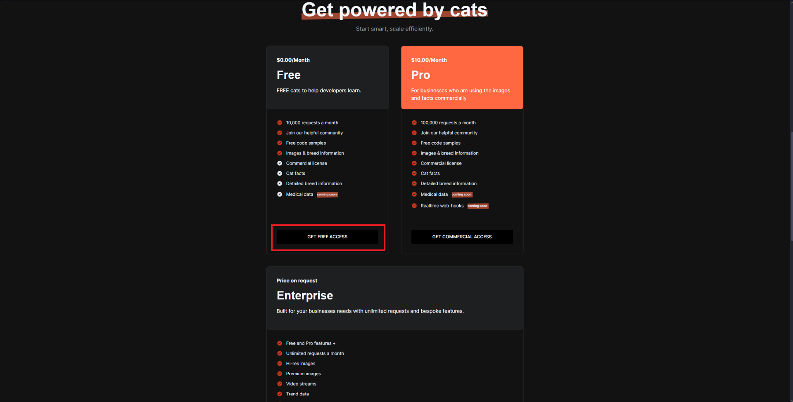

* * *

# Groupe : Louis BLANLEUIL, Bastien DE VIENNE, WALLIN Mathieu

# Étapes du TP

## 1. Choix et exploration d'une API publique

Nous avons décider de choisir l'API publique The Cat API, voici les étapes pour pouvoir récupérer la clé API gratuite :





### Voici les Endpoint disponibles :

1. **/v1/images/search**

Description : Permet de rechercher des images de chats.
Paramètres :
- limit: Nombre d'images à récupérer (par défaut 1).
- page: Page de résultats.
- order: Ordre de tri des images (par défaut aléatoire).
- size: Taille de l'image (small, medium, full).
- format: Format de la réponse (json, xml).
- has_breeds: Filtrer par race.
- category_ids: Filtrer par catégorie (ex: "funny", "cute").

2. **/v1/images/{image_id}**

Description : Permet d'obtenir les détails d'une image de chat spécifique.
Paramètres :
- image_id: L'ID de l'image pour récupérer ses détails.

3. **/v1/breeds**

Description : Récupère une liste de toutes les races de chats.
Paramètres : Aucun.

4. **/v1/categories**

Description : Récupère une liste de toutes les catégories d'images (ex: "funny", "cute").
Paramètres : Aucun.

5. **/v1/votes**

Description : Permet de voter pour une image (avec une clé API validée). 
Paramètres :
- image_id: ID de l'image.
- value: Le vote (1 pour aimer, -1 pour ne pas aimer).

6. **/v1/favourites**

Description : Permet d'ajouter ou de récupérer les images favorites.
Paramètres :
- image_id: ID de l'image à ajouter.

7. **/v1/images/upload**

Description : Permet de télécharger une image depuis un fichier local pour l'ajouter à la plateforme.
Paramètres :
- file: Fichier image à télécharger

8. **/v1/votes/{vote_id}**

Description : Permet de supprimer un vote pour une image donnée.
Paramètres :
- vote_id: L'ID du vote à supprimer.

9. **/v1/images/search?breed_ids={breed_id}**

Description : Permet de rechercher des images d'une race spécifique de chat.
Paramètres :
- breed_ids: L'ID de la race de chat.

### Testez l'API avec Postman


Contenu du JSON :
```json
[
    {
        "breeds": [],
        "id": "2m1",
        "url": "https://cdn2.thecatapi.com/images/2m1.jpg",
        "width": 480,
        "height": 360
    },
    {
        "breeds": [],
        "id": "a0t",
        "url": "https://cdn2.thecatapi.com/images/a0t.jpg",
        "width": 500,
        "height": 500
    },
    {
        "breeds": [
            {
                "weight": {
                    "imperial": "7 - 15",
                    "metric": "3 - 7"
                },
                "id": "toyg",
                "name": "Toyger",
                "vetstreet_url": "http://www.vetstreet.com/cats/toyger",
                "temperament": "Playful, Social, Intelligent",
                "origin": "United States",
                "country_codes": "US",
                "country_code": "US",
                "description": "The Toyger has a sweet, calm personality and is generally friendly. He's outgoing enough to walk on a leash, energetic enough to play fetch and other interactive games, and confident enough to get along with other cats and friendly dogs.",
                "life_span": "12 - 15",
                "indoor": 0,
                "lap": 1,
                "alt_names": "",
                "adaptability": 5,
                "affection_level": 5,
                "child_friendly": 4,
                "dog_friendly": 5,
                "energy_level": 5,
                "grooming": 1,
                "health_issues": 2,
                "intelligence": 5,
                "shedding_level": 3,
                "social_needs": 3,
                "stranger_friendly": 5,
                "vocalisation": 5,
                "experimental": 0,
                "hairless": 0,
                "natural": 0,
                "rare": 0,
                "rex": 0,
                "suppressed_tail": 0,
                "short_legs": 0,
                "wikipedia_url": "https://en.wikipedia.org/wiki/Toyger",
                "hypoallergenic": 0,
                "reference_image_id": "O3F3_S1XN"
            }
        ],
        "id": "1QofNBGEu",
        "url": "https://cdn2.thecatapi.com/images/1QofNBGEu.jpg",
        "width": 750,
        "height": 750
    }
]
```

Données importantes qui pourrant etre réutilisées :
- breeds
- id
- url
- width
- height
